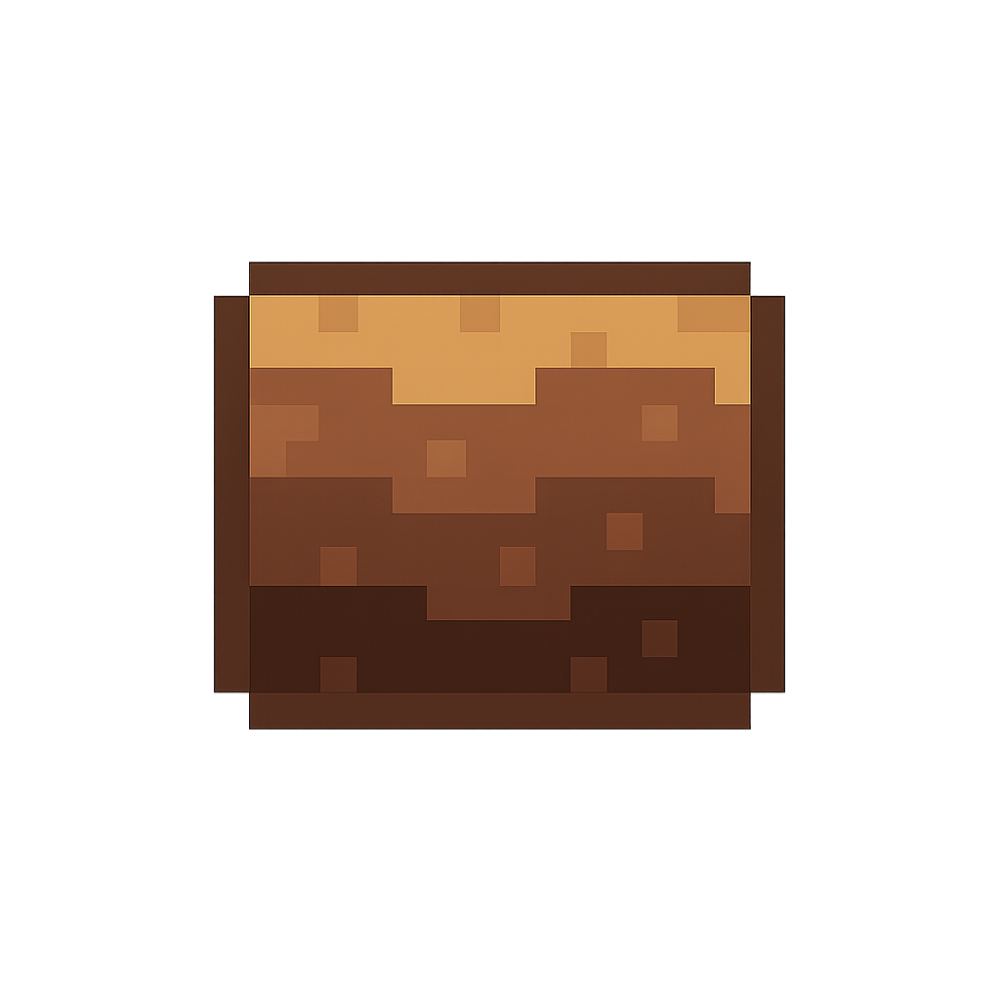

# Terra CLI

<p align="center">
  
</p>

**Advanced Developer Tools for Fern UI Framework**

Terra is the command-line interface that orchestrates Fern UI Framework development with powerful, intuitive commands. Think of it as the conductor of your Fern development orchestra.

## Features

- **Project Creation**: `fern sprout` - Create new Fern projects with customizable templates
- **Build & Run**: `fern fire` - Build and run projects for multiple platforms (Linux, Web)
- **Health Check**: `fern bloom` - Verify system dependencies and configuration
- **Project Preparation**: `fern prepare` - Prepare projects for deployment
- **Template Management**: `fern templates` - Manage and create project templates
- **Cross-Platform**: Native Linux applications and WebAssembly for web
- **Live Reload**: Real-time development feedback

## Quick Start

### Installation

```bash
# Clone the Fern framework repository
git clone https://github.com/fernkit/fern.git
cd fern

# Install Terra CLI and Fern framework
./install.sh
```

### Your First Fern App

```bash
# Check system health
fern bloom

# Create a new project
fern sprout my_awesome_app

# Enter project directory
cd my_awesome_app

# Run your app (Linux)
fern fire

# Run for web platform
fern fire -p web
```

## Commands Reference

### `fern bloom` - System Health Check
Verifies that all dependencies are installed and configured correctly.

```bash
fern bloom
```

**What it checks:**
- Python 3 installation
- C++ compiler (g++/clang++)
- CMake build system
- Fern C++ library
- System dependencies (X11, fontconfig, freetype)
- Emscripten (for web builds)

### `fern sprout <project_name>` - Create New Project
Creates a new Fern project with the specified name using templates.

```bash
fern sprout my_project
```

**Project structure created:**
```
my_project/
├── lib/           # Main source code
│   └── main.cpp   # Entry point
├── web/           # Web platform files
│   └── template.html  # Customizable HTML template
├── linux/         # Linux platform files
├── assets/        # Images, fonts, etc.
├── examples/      # Example code
├── fern.yaml      # Project configuration
└── README.md      # Project documentation
```

### `fern fire [options]` - Build and Run
Builds and runs your Fern project. Supports multiple platforms.

```bash
# Run for Linux (default)
fern fire

# Run for web platform
fern fire -p web
fern fire --platform web

# Run specific file
fern fire main.cpp
fern fire -p web main.cpp
```

**Options:**
- `-p, --platform <platform>` - Target platform (linux, web)
- `-h, --help` - Show help

### `fern prepare <platform>` - Prepare for Deployment
Prepares your project for deployment to the specified platform.

```bash
fern prepare web
fern prepare linux
```

### `fern templates` - Template Management
Manage project templates for different use cases.

```bash
fern templates list
fern templates create my_template
fern templates install <template_name>
```

## Platform Support

### Linux (Native)
- **Technology**: X11 with direct rendering
- **Features**: Native performance, system integration
- **Build**: Uses g++/clang++ with CMake
- **Output**: Native executable

### Web (WebAssembly)
- **Technology**: Emscripten + WebAssembly
- **Features**: Runs in any modern browser
- **Build**: Uses emcc compiler
- **Output**: HTML + WASM + JS files

## Configuration

Terra uses `~/.fern/config.yaml` for global configuration:

```yaml
# Fern UI Framework Global Configuration
version: "0.1.0"
cpp_library_path: "~/.local"
templates_path: "~/.fern/templates"
default_template: "basic"
build:
  default_flags: ["-std=c++17", "-O2"]
  debug_flags: ["-std=c++17", "-g", "-O0"]
  include_paths: ["~/.local/include"]
  library_paths: ["~/.local/lib"]
  libraries: ["fern", "X11", "Xext", "fontconfig", "freetype"]
```

## Web Template Customization

Terra creates customizable HTML templates for web builds:

```html
<!-- web/template.html -->
<!doctype html>
<html>
<head>
    <title>My Fern App</title>
    <style>
        /* Your custom styles */
        body { background: linear-gradient(45deg, #1e3c72, #2a5298); }
    </style>
</head>
<body>
    <h1>Welcome to My Fern App</h1>
    <canvas id="canvas"></canvas>
    <script>var Module = {canvas: document.getElementById('canvas')};</script>
    {{{ SCRIPT }}}
</body>
</html>
```

## Example Usage

### Basic Application
```cpp
#include <fern/fern.hpp>
#include <iostream>

using namespace Fern;

void draw() {
    // Clear background
    Draw::fill(Colors::DarkGray);
    
    // Draw welcome message
    DrawText::drawText("Hello, Terra!", 50, 50, 3, Colors::Cyan);
    
    // Interactive button
    if (Button("Click me!", 50, 100)) {
        std::cout << "Button clicked!" << std::endl;
    }
}

int main() {
    std::cout << "🌿 Starting Fern application..." << std::endl;
    
    Fern::initialize();
    Fern::setDrawCallback(draw);
    Fern::startRenderLoop();
    
    return 0;
}
```

### Layout Example
```cpp
#include <fern/fern.hpp>

using namespace Fern;

void draw() {
    Draw::fill(Colors::DarkGray);
    
    // Column layout
    Column({
        Text("Welcome to Fern UI", Colors::White),
        
        Row({
            Button("Button 1", 10, 10),
            Button("Button 2", 10, 10),
            Button("Button 3", 10, 10)
        }),
        
        Container({
            Circle(50, Colors::Red),
            Text("Beautiful UI Components", Colors::LightGray)
        })
    });
}
```

## Development Workflow

1. **Create Project**: `fern sprout my_app`
2. **Health Check**: `fern bloom`
3. **Develop**: Edit `lib/main.cpp`
4. **Test Linux**: `fern fire`
5. **Test Web**: `fern fire -p web`
6. **Customize**: Edit `web/template.html`
7. **Deploy**: `fern prepare web`

## Integration with Fern Ecosystem

Terra CLI is part of the Fern UI Framework ecosystem:

- **[Fern Core](https://github.com/fernkit/fern)**: The main UI framework library (C++)
- **[Terra CLI](https://github.com/fernkit/terra)**: This developer command-line interface
- **[Flare](https://github.com/fernkit/flare)**: Additional development tools and extensions

## Troubleshooting

### Common Issues

**Terra CLI not found:**
```bash
# Add to PATH
export PATH="$HOME/.local/bin:$PATH"

# Or restart terminal
source ~/.bashrc
```

**Build errors:**
```bash
# Check system health
fern bloom

# Install missing dependencies
sudo apt-get install build-essential cmake pkg-config libx11-dev
```

**Web build fails:**
```bash
# Install Emscripten
git clone https://github.com/emscripten-core/emsdk.git
cd emsdk
./emsdk install latest
./emsdk activate latest
source ./emsdk_env.sh
```

## Contributing

1. Fork the repository
2. Create a feature branch (`git checkout -b feature/amazing-feature`)
3. Commit your changes (`git commit -m 'Add amazing feature'`)
4. Push to the branch (`git push origin feature/amazing-feature`)
5. Open a Pull Request

## License

MIT License - see LICENSE file for details.

---

**Terra CLI - Powering Fern UI Framework Development**